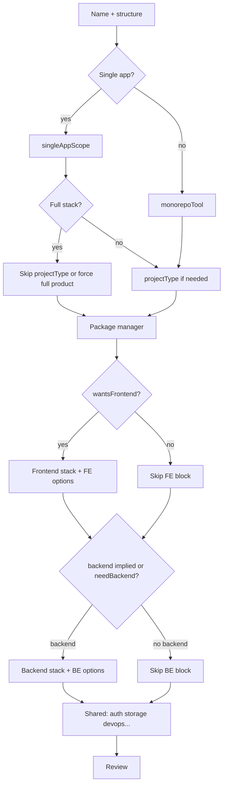

# Wizard architecture: current state and restructure plan

This document describes how the interactive CLI decides **which questions to show**, **which option lists to use**, and **how answers map to generated structure**. Use it as the single source of truth before changing prompts or visibility logic.

**Target repo layout (plugins, layouts, generator, tests):** see [TARGET-REPOSITORY-STRUCTURE.md](./TARGET-REPOSITORY-STRUCTURE.md).

---

## 1. Where logic lives

| Area | File(s) |
|------|---------|
| Question order, `when` guards, dynamic `choices` | `src/cli/prompt-definitions.ts` |
| Derived “do we have frontend/backend?” | `src/cli/visibility.ts` |
| Normalizing raw answers → `PromptAnswers` (defaults, overrides) | `src/cli/build-answers.ts` |
| Prompt loop (back navigation, skipping) | `src/cli/run-wizard.ts` |
| Choice catalogs & backend-specific lists | `src/cli/choices-registry.ts` |
| Generated layout & files | `src/generator/`, `src/layouts/`, `src/plugins/**` |

---

## 2. Core derived flags (`visibility.ts`)

These drive most `when` clauses in `QUESTION_DEFS`.

### `wantsFrontend(ctx)`

| Condition | Result |
|-----------|--------|
| `projectStructure === "Single app"` **and** `singleAppScope === "Backend only"` | **false** |
| `projectType === "API only"` | **false** |
| Otherwise | **true** |

### `wantsBackend(ctx)`

| Condition | Result |
|-----------|--------|
| `projectType === "Mobile app"` | **false** |
| Single app + `Frontend only` | **false** |
| Single app + `Backend only` | **true** |
| Single app + `Full stack (frontend + backend)` | **true** |
| `projectType === "API only"` | **true** |
| `projectType === "Full product (web + api)"` | **true** |
| **Else** | **`Boolean(ctx.needBackend)`** |

So for **Monorepo** and **Microservices**, backend is **not** implied by structure alone; it depends on the **`needBackend`** answer unless `projectType` is already `API only` or `Full product (web + api)`.

### Other helpers

- `wantsWebFrontendStack`: frontend wanted, web stack, not Flutter-only mobile path.
- `wantsReactNativeStylePackages`: Expo/RN or mobile project type with RN-style FE.
- `isMobileAppType`: `projectType === "Mobile app"`.

---

## 3. `buildAnswers` behavior (after the wizard)

Important normalizations:

- **Mobile app**: forces `projectStructure: "Single app"`, `singleAppScope: "Frontend only"`, `needBackend: false`, `frontendPlatform: "Mobile"`.
- **Implicit full product**: if `Single app` + `Full stack (frontend + backend)"`, then `projectType` becomes **`"Full product (web + api)"`** even though `projectType` was skipped in the wizard.
- **`needBackend` in output**: set to `wantsBackend(raw)` (computed), not necessarily the raw checkbox.

So final `PromptAnswers.needBackend` aligns with `wantsBackend`, but the **wizard can still ask** `needBackend` in cases where the user expects structure to imply backend (see section 5).

---

## 4. Question flow (current order)

Order is fixed in `QUESTION_DEFS` in `prompt-definitions.ts`. A step runs only if `when(draft)` is true (except steps with no `when`, which default to true).

Rough pipeline:

1. **name**
2. **projectStructure** (Mobile → only `Single app`)
3. **singleAppScope** (only if `Single app`)
4. **projectType** (skipped if `Single app` + full stack; otherwise full list)
5. **monorepoTool** (monorepo or microservices only)
6. **packageManager**
7. **frontendPlatform** (`wantsFrontend` and not mobile **project type**)
8. **frontend** (depends on platform / mobile type)
9. **frontendTypescript**, **frontendStyling** (web), **stateData**, **forms**, **frontendExtras** (web), **apiClient**
10. **needBackend** (see section 5 for when this appears)
11. **basicPackagesFrontend**
12. **backend** … **basicPackagesBackend** (if `wantsBackend(draft)` at prompt time)
13. **fileStorage** (`wantsFrontend \|\| wantsBackend`)
14. **authentication** (always; choices filtered if frontend-only + backend)
15. **authFeatures** (if auth ≠ None)
16. **devTools**, **testing** (choices filtered if no frontend), **logging** (backend), **monitoring**, **devOps**, **deployment**, **advancedFeatures** (backend), **aiFeatures**
17. **setupAction**

Dynamic **choice** lists already exist for: API type, ORM, backend utilities, auth (hide NextAuth when no frontend), testing, monitoring, deployment, frontend packages by framework, etc.

---

## 5. Gaps: redundant or imprecise prompts

### 5.1 “Do you need backend?” vs structure / type

**Shown when** (`needBackend` question):

- Not mobile
- `projectStructure` is **not** `Single app`
- `projectType` is **not** `API only`
- `projectType` is **not** `Full product (web + api)`

**Problem cases:**

1. **Microservices (multiple backend services)**  
   Name implies multiple **backend** services. Asking “Do you need backend?” is almost always redundant; default should be **yes** and the question should be **skipped** (or reframed: “API-only repo?” only if you officially support microservices without generated backends).

2. **Monorepo + types like “SaaS app” or “Admin dashboard”**  
   Many users assume an API exists. The question is still logically valid (design-system-only monorepo) but feels noisy. Options: skip when `projectType` implies full product, or move to “Include API app in monorepo?” with clearer defaults.

3. **Single app + Full stack**  
   Backend is implied; **`needBackend` is not asked** (good). `wantsBackend` is true without storing `needBackend` in raw draft until `buildAnswers` (OK).

### 5.2 `wantsBackend(draft)` during the wizard vs after `buildAnswers`

Backend block questions use `when: (a) => wantsBackend(a)`.

For monorepo, **before** the user answers `needBackend`, `wantsBackend` is **`Boolean(needBackend)`** which is **false** until they say yes. So order matters: **`needBackend` is placed before** `basicPackagesFrontend` but **after** most frontend questions.

If `needBackend` default in UI is “Yes”, first paint might still be false for `needBackend` undefined—check Inquirer defaults. If undefined, `wantsBackend` could be false briefly; the code uses `getDefault: (d) => d.needBackend ?? true` for the confirm.

Actually for confirm, `wantsBackend` when `needBackend` is undefined: `Boolean(undefined)` → **false**. So **backend questions are hidden until after `needBackend`** is answered—but `needBackend` comes **after** frontend block. That order is intentional: collect FE first, then ask BE.

The redundancy issue is **only** for structures where backend should be structurally implied (especially **microservices**).

### 5.3 Authentication always on

**authentication** has `when: () => true` even when there is **no frontend and no backend** (theoretical if flags bug; normally API-only has backend). For **frontend-only** single app, auth choices may include **NextAuth** (needs Next). Filtering is partial; worth tightening to stack (e.g. NextAuth only if Next.js frontend).

### 5.4 `projectType` vs `singleAppScope`

For single app full stack, `projectType` is skipped and forced to **Full product (web + api)** in `buildAnswers`. Good.

For monorepo, user still picks **projectType** including **“Full product (web + api)”** which then skips `needBackend`—consistent.

### 5.5 Mobile path

Mobile forces no backend in `buildAnswers`; `needBackend` prompt is skipped for mobile **project type**. Aligns with `wantsBackend` false for mobile.

---

## 6. What the generator can do today (high level)

From `createProject` and setup modules:

- **Layouts:** single repo (various splits), monorepo (Turborepo / Nx / basic workspace), microservices-style.
- **Frontends:** multiple web frameworks, Expo/RN, Flutter, or none (API-only).
- **Backends:** several Node and non-Node stacks; optional tRPC/GraphQL/gRPC depending on backend.
- **Data:** DB + ORM options per backend; optional Redis, file storage hints.
- **Auth, logging, monitoring, DevOps, Docker, AI package stubs** tied to answers.
- **Basic package checklists** per frontend/backend.

The **wizard** does not yet fully **narrow** every list based on prior answers (some lists are static or only partially filtered). The **structure** is driven by `PromptAnswers` after `buildAnswers`.

---

## 7. Proposed restructure principles (for implementation later)

1. **Single source of truth for “backend required”**  
   Define a function e.g. `backendImpliedByStructureAndType(ctx)` that returns `boolean | "ask"`.  
   - Microservices → **implied true** (skip `needBackend`).  
   - Monorepo → **ask** or use `projectType` to default (e.g. API only → true; optional “library only” type later).  
   - Single app → keep current `singleAppScope` rules.

2. **Question DAG or phases**  
   Group: **Project shape → Tooling → Frontend block → Backend block → Shared concerns → Review**.  
   Within each phase, skip entire blocks when flags false (no duplicate confirms).

3. **Choice narrowing**  
   Every `list`/`checkbox` should use `choices(ctx)` that filters incompatible options (auth methods vs stack, E2E only with frontend, etc.).

4. **Align `wantsBackend` during wizard**  
   When backend is implied, set a synthetic `needBackend: true` on the draft before backend questions so `wantsBackend` matches final `buildAnswers` without special cases.

5. **Document parity**  
   Keep this file updated when adding project types or structures.

---

## 8. Suggested flow (target)

---

## 9. Next steps checklist (when you proceed)

- [ ] Implement `backendImpliedByStructureAndType` (or equivalent) and adjust `needBackend` `when` + defaults.  
- [ ] Re-run through all combinations: single FE-only, single BE-only, full stack, monorepo+SaaS, monorepo+API only, microservices, mobile.  
- [ ] Add regression notes or snapshot tests for `wantsFrontend` / `wantsBackend` / `buildAnswers` outputs.  
- [ ] Optionally split `QUESTION_DEFS` into phased arrays for readability.  
- [ ] Update user-facing README “What you get” if new types or skips change behavior.

---

## 10. Quick reference: files to touch for wizard-only changes

| Change | Primary file |
|--------|----------------|
| Add/remove/reorder questions | `prompt-definitions.ts` |
| Fix “should we show backend?” | `visibility.ts` + `prompt-definitions.ts` (`needBackend` when) |
| Fix final defaults | `build-answers.ts` |
| New project type / structure | `choices-registry.ts`, `visibility.ts`, `build-answers.ts`, `setup/*` |

---

*Last updated to match the codebase layout as of this document’s authoring. Update section 4–5 whenever `QUESTION_DEFS` or `wantsBackend` / `wantsFrontend` change.*
